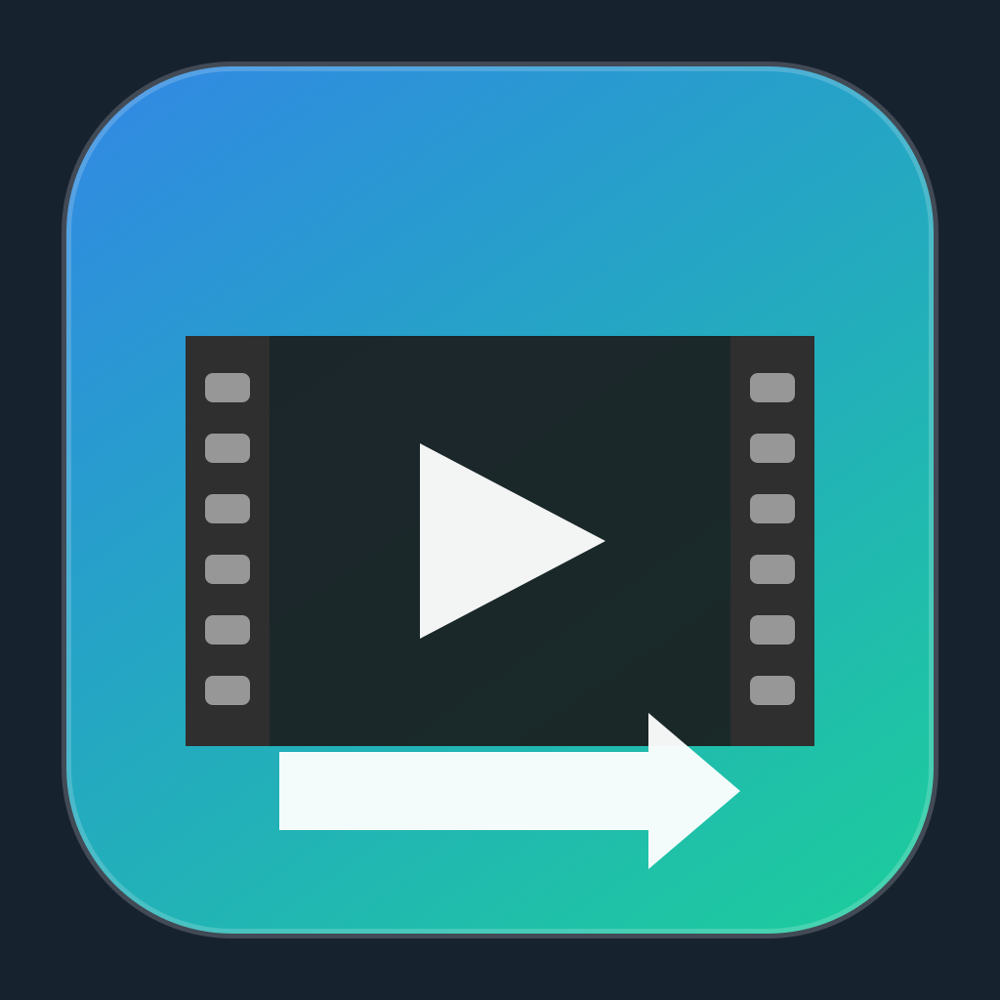

<p align="center">
  
</p>

<h1 align="center">iMovie Format Converter</h1>

<p align="center">
  <strong>Native macOS batch conversion for iMovie-ready MOV files.</strong><br>
  <em>Drag in videos, export H.264 + AAC QuickTime files, powered by ffmpeg.</em>
</p>

<p align="center">
  <a href="#building-a-working-app-from-source">Build</a> &bull;
  <a href="#how-to-use-the-app">Usage</a> &bull;
  <a href="#features">Features</a> &bull;
  <a href="#license-and-third-party-notices">License</a>
</p>

---

> **This project is no longer maintained.** It was a personal tool that served its purpose and is now archived as open source under the MIT license. No further updates, bug fixes, or support will be provided. That said, the app works - feel free to build it yourself and use it as-is.

A native macOS batch converter app that converts dragged-and-dropped media into an iMovie-friendly format (H.264 + AAC in a `.mov` container). Built with SwiftUI and powered by `ffmpeg`.

## Building a working app from source

### Prerequisites

- A Mac running **macOS 13+**
- **Xcode Command Line Tools** (or full Xcode) with Swift 5.10+
- **ffmpeg** and **ffprobe** installed via Homebrew

```bash
# Install Xcode Command Line Tools (if not already installed)
xcode-select --install

# Install ffmpeg
brew install ffmpeg
```

### Option 1: Export as a desktop .app bundle (recommended)

This builds a release binary and creates a standalone `VideoConverterOsx.app` on your Desktop, with `ffmpeg` and `ffprobe` bundled inside when they are available on your machine:

```bash
git clone https://github.com/karagioules/OSX_iMovie-Video-File-Converter.git
cd OSX_iMovie-Video-File-Converter
chmod +x scripts/export_app.sh scripts/build_icon.sh
./scripts/export_app.sh
```

The app will appear at `~/Desktop/VideoConverterOsx.app`. Double-click to launch.
The export script copies the MIT license, third-party notices, and ffmpeg license/build information into the app bundle resources when ffmpeg is available.

### Option 2: Run directly from source

```bash
git clone https://github.com/karagioules/OSX_iMovie-Video-File-Converter.git
cd OSX_iMovie-Video-File-Converter
swift run VideoConverterOsxApp
```

This requires `ffmpeg` and `ffprobe` to be on your PATH.

## How to use the app

1. Launch `VideoConverterOsx.app`
2. Click **Select Media** or drag files/folders into the drop zone
3. Click **Set Export Path** and choose your output folder
4. Click **Convert**
5. Wait for the queue to finish - failed items are shown inline

Output files are named `<original>_imovie.mov`.

## What it converts to

| Setting | Value |
|---------|-------|
| Container | QuickTime MOV (`.mov`) |
| Video | H.264 (`libx264`, `yuv420p`, profile high, level 4.1) |
| Audio | AAC stereo at 192k |
| Atom placement | `+faststart` (streaming-friendly) |

## Supported input formats

`3gp`, `avi`, `m2ts`, `m4v`, `mkv`, `mov`, `mp4`, `mpeg`, `mpg`, `mts`, `mxf`, `ts`, `vob`, `webm`, `wmv`

## Features

- Drag and drop files or entire folders (recursive scan)
- Batch queue with per-item status and progress bars
- Overall progress tracking
- Export path picker
- Cancel in-progress conversions
- Conversion failures are isolated per item; the rest of the queue continues

## Project structure

- `Sources/VideoConverterOsxApp/` - SwiftUI app and UI logic
- `Sources/VideoConverterCore/` - ffmpeg/ffprobe integration and progress parsing
- `Tests/VideoConverterCoreTests/` - unit and integration tests
- `scripts/export_app.sh` - builds and exports the `.app` bundle
- `scripts/build_icon.sh` - generates the app icon

## License and third-party notices

VideoConverterOsx is released under the [MIT License](LICENSE).

This project does not vendor ffmpeg in source control. The export script can copy locally installed `ffmpeg` and `ffprobe` binaries into the exported `.app` bundle. ffmpeg is a third-party project with its own license terms, typically LGPL-2.1+ or GPL depending on how the binary was built. If you redistribute an exported app bundle, preserve the files generated under `Contents/Resources/` and verify the bundled ffmpeg build's obligations with:

```bash
ffmpeg -L
ffmpeg -version
```

See [THIRD_PARTY_NOTICES.md](THIRD_PARTY_NOTICES.md) for redistribution notes.
